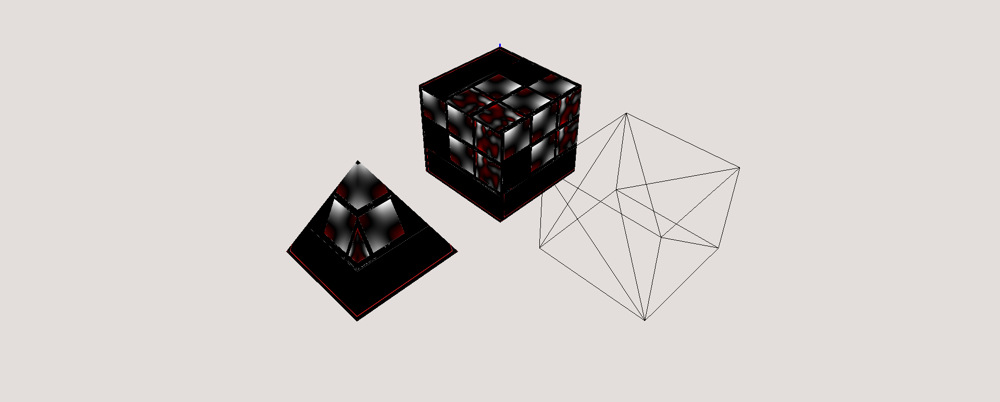

# Soft body simulator


This project simulates soft bodies under a uniform external force (gravity).

# Compile
Project was compiled with CMake 3.8 on standard C++ v14. Display was built using [OpenGL](https://www.opengl.org/) 4.6.0. For matrix 
manipulation, 
project uses [Eigen](http://eigen.tuxfamily.org/index.php?title=Main_Page) 3.5.

# Run
To run the simulator you should write a config file parametrising the simulator environment. The config file should 
look as following:

```bash
# mass x y z model_file texture_file
o 10.0 0.0 0.0 1.0 ../res/objects/cube.obj ../res/textures/anfis.bmp    # Define objects and their parameters 
o 10.0 2.0 0.0 4.0 ../res/objects/pyramid.obj ../res/textures/cat.bmp   # (texutre is optional, but leave an '_')
o 10.0 0.1 2.0 3.0 ../res/objects/cloth.obj

rms 50                                                                  # Refresh rate (ms)
eul 10                                                                  # Euler iterations between draws

g 0.0 0.0 -5.0                                                          # Gravity vector
k 200                                                                   # Global spring constant
kt 30                                                                   # Global spring velocity decay
grb 0.9                                                                 # Ground rebound coef
orb 1e-6                                                                # Global object rebound coef

```

# Simulator controls
| Key | Action |
| --- | --- |
| space | play/pause the simulation |
| + | increase gravity by 0.1 |
| - | decrease gravity by 0.1 |
| a | move camera on x by +1 |
| d | move camera on x by -1 |
| q | move camera on y by +1 |
| e | move camera on y by -1 |
| w | move camera on z by +1 |
| s | move camera on z by -1 |
| o | increase fovy by 10 |
| u | decrease fovy by 10 |
| i | zoom in toward center |
| k | zoom out from center |
| j | rotate left around center |
| l | rotate right around center |
| x | toggle forcing the wire model |
| mouse_left_key | rotate left around center |
| mouse_right_key | rotate right around center |
| mouse_scroll_up | zoom in toward center |
| mouse_scroll_down | zoom out from center |

# Acknowledgements

The lab assignments were a part of the [Computer Graphics](https://www.fer.unizg.hr/en/course/comgra_a) course at 
[FER](https://www.fer.unizg.hr/en).